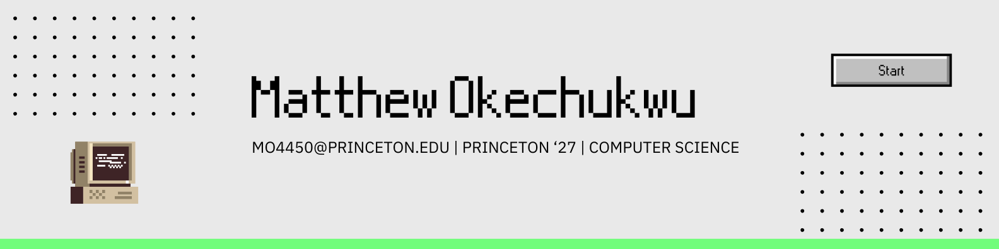

## Hi there 👋

Greetings, and welcome to my Github page! It is a pleasure to have you here. I’m Matthew, and I am an aspiring software developer from Houston, Texas. Since my introduction to programming in my junior year of highschool, I have been very passionate about the field and my innovative future in such. Since then, my incredible journey has consisted of intriguing challenges and learning moments when it has come to exploring various programming languages, frameworks, and tools. I look forward to the role I play in the world of programming, driving innovation through collaboration and creativity.

## Let's Connect!
Thank you for visiting my GitHub profile. If you find anything interesting or have any questions, feel free to reach out via:

LinkedIn: https://www.linkedin.com/in/mokechukwu/

Email: mo4450@princeton.edu

I'm passionate about creating impact and driving change! Let's connect, share ideas, and make a positive impact on the world of technology together!

Happy coding! 🚀

Matthew Okechukwu
